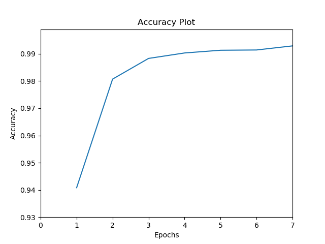
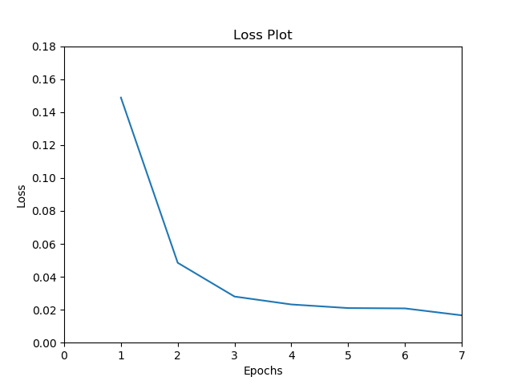
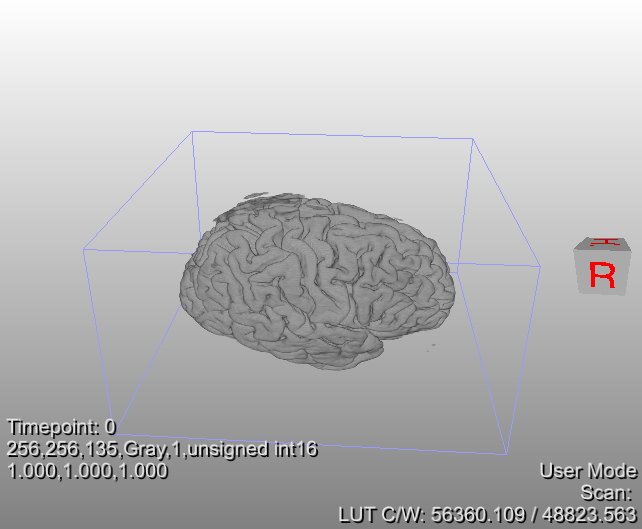
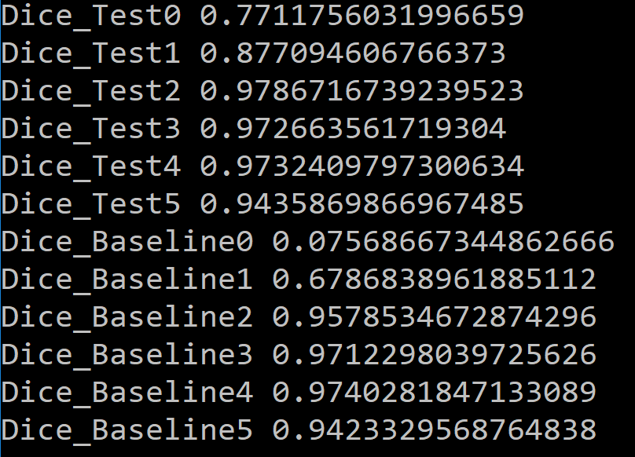

# 🧠 Brain Tumor Segmentation Using U-Net

This repository contains the implementation of a deep learning model using the **U-Net** architecture for automated brain tumor segmentation from **MRI scans**. This project aims for precise segmentation of tumor regions to aid in critical tasks like diagnosis and treatment planning.

-----

## 💡 Project Overview

The core of this project is a **U-Net** model, implemented with **Keras** and **TensorFlow**, specifically tailored for medical image segmentation. It uses data augmentation for robustness and is optimized with **Binary Cross-Entropy Loss** and the **Adam optimizer**.

### Key Features

  * **U-Net Architecture**: Designed for pixel-wise semantic segmentation of medical images.
  * **Data Augmentation**: Robust training via geometric transformations using `ImageDataGenerator`.
  * **Optimization**: **Adam** optimizer and **Binary Cross-Entropy** loss.
  * **Evaluation**: Performance measured using the **Dice Coefficient** (F1-score) against both model predictions and a baseline.

-----

## 🛠️ Technologies Used

  * **Python**
  * **Keras**
  * **TensorFlow**
  * **OpenCV**
  * **Numpy**
  * **Scikit-image (skimage)**

-----

## 🚀 Getting Started

### Prerequisites

Install the necessary libraries:

```bash
pip install tensorflow keras numpy opencv-python scikit-image matplotlib
```

### Data Preparation

1.  Structure your training and testing data within the `data/brain/` directory.
2.  The model expects image and mask folders (e.g., `image` and `label`) for training, and test images, manual masks, and baseline masks for validation.

### Training and Prediction

Execute the main script (`main.py`) to start training and generate predictions:

```bash
python main.py
```

This script trains the model for **7 epochs**, saves the best weights to `unet_brain.hdf5`, and generates segmented images in the test directory.

-----

## 📊 Visualization and Results

### Training Convergence

The plots below illustrate the model's convergence over 7 epochs of training. The model shows rapid improvement in both accuracy and loss.

#### Accuracy Plot



#### Loss Plot



### 3D Segmentation Result

The model's segmentation output provides a precise mask of the tumor, which can be used for 3D reconstruction and visualization of the affected brain areas.



### Dice Coefficient Evaluation

The **Dice Coefficient** is the primary evaluation metric, measuring the overlap between the predicted mask and the ground truth. A score closer to **1.0** is ideal. The results below compare the U-Net model's predictions (`Dice_Test`) against a simple baseline approach (`Dice_Baseline`).


